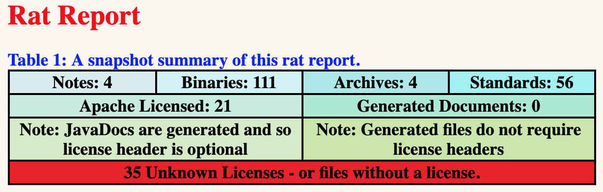

# Apache RAT (Release Audit Tool) Gradle Plugin

[](https://travis-ci.org/eskatos/creadur-rat-gradle)
[](http://www.apache.org/licenses/LICENSE-2.0.txt)

This plugin allows to run the [Apache RAT](https://creadur.apache.org/rat/) release audit tool, focused on licenses.

## Installation

In your `build.gradle(.kts)` file:

```kotlin
plugins {
    id("org.nosphere.apache.rat") version "0.5.2"
}
```

## Usage

The plugin registers a task named `rat` that you can configure in your `build.gradle(.kts)` file:

<details open>
<summary>Kotlin DSL</summary>

```kotlin
tasks.rat {

    // Input directory, defaults to '.'
    inputDir.set("some/path")

    // List of Gradle exclude directives, defaults to ['**/.gradle/**']
    excludes.add("**/build/**")

    // RatTask 0.5.0+ implements PatternFilterable
    exclude { it.file in configurations.someConf.files }

    // Rat excludes file, one directive per line
    excludeFile.set(layout.projectDirectory.file(".rat-excludes.txt"))

    // XML, TXT and HTML reports directory, defaults to 'build/reports/rat'
    reportDir.set(file("some/other/path"))

    // Custom XSL stylesheet for the HTML report
    stylesheet.set(file("custom/rat-html-stylesheet.xsl"))

    // Fail the build on rat errors, defaults to true
    failOnError.set(false)
}
```

</details>
<details>
<summary>Groovy DSL</summary>

```groovy
rat {

    // Input directory, defaults to '.'
    inputDir.set("some/path")

    // List of Gradle exclude directives, defaults to ['**/.gradle/**']
    excludes.add("**/build/**")

    // Rat excludes file, one directive per line
    excludeFile.set(layout.projectDirectory.file(".rat-excludes.txt"))

    // XML, TXT and HTML reports directory, defaults to 'build/reports/rat'
    reportDir.set(file("some/other/path"))

    // Custom XSL stylesheet for the HTML report
    stylesheet.set(file("custom/rat-html-stylesheet.xsl"))

    // Fail the build on rat errors, defaults to true
    failOnError.set(false)

    // Prints the complete plain text report, defaults to false
    verbose.set(true) 
}
```

</details>


You can run the `rat` task by invoking Gradle:

```
gradle rat
```

If the project has a `check` task, then the `rat` task is automatically registered as dependent on the former.

When a Rat audit fails, a clickable URL of the HTML report will be printed out:

```
FAILURE: Build failed with an exception.

* What went wrong:
Execution failed for task ':rat'.
> Apache Rat audit failure - 35 unapproved licenses
    See file:///path/to/build/reports/rat/index.html
```




## Compatibility

The plugin requires Gradle 4.7 or greater or Gradle 5.x.

The plugin requires Java 6 or greater, tested with up to Java 10 using Gradle 4.7 and Java 11 using Gradle >= 4.8.

### Plugin compatibility history

    Plugin version | Minimum | Maximum Gradle version
             0.5.2 |    4.7  | 5.x
             0.5.1 |    4.7  | 5.x
             0.5.0 |    4.7  | 5.x
             0.4.0 |    4.7  | 5.x
             0.3.1 |   2.14  | 4.x
             0.3.0 |   2.14  | 4.x
             0.2.0 |   2.14  | 4.x
             0.1.0 |   2.14  | 4.x
