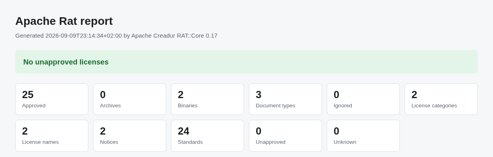

# Apache RAT (Release Audit Tool) Gradle Plugin

[](https://github.com/eskatos/creadur-rat-gradle/actions/workflows/gradle-build-pr.yml)
[](http://www.apache.org/licenses/LICENSE-2.0.txt)

This plugin allows to run the [Apache RAT](https://creadur.apache.org/rat/) release audit tool, focused on licenses.

It bundles Apache RAT `0.17`. The RAT version is an implementation detail and cannot be changed.

## Installation

In your `build.gradle(.kts)` file:

```kotlin
plugins {
    id("org.nosphere.apache.rat") version "0.10.0"
}
```

Upgrading from `0.9.0`? See the [migration guide](CHANGELOG.md).

## Usage

The plugin registers a task named `rat` that you can configure in your `build.gradle(.kts)` file:

<details open>
<summary>Kotlin DSL</summary>

```kotlin
tasks.rat {

    // Use the default RAT license header matchers, defaults to `true`
    addDefaultMatchers.set(false)

    // Add custom substring license header matchers
    // First argument is the license family category: at most 5 characters,
    // and it must not clash with another license family
    substringMatcher("MYFOO", "My Foo License", "pattern-1", "pattern-2")

    // Declare approved license families, by name or by category
    // If used, any non-declared family won't be approved
    approvedLicense("MIT")

    // Input directory, defaults to '.'
    inputDir.set(file("some/path"))

    // List of Gradle exclude directives, defaults to ['**/.gradle/**']
    excludes.add("**/build/**")

    // RatTask 0.5.0+ implements PatternFilterable
    exclude { it.file in configurations.someConf.files }

    // XML, TXT and HTML reports directory, defaults to 'build/reports/rat'
    reportDir.set(file("some/other/path"))

    // Fail the build when the audit finds unapproved licenses, defaults to true
    // Invalid configuration always fails the build, whatever this is set to
    failOnError.set(false)

    // Print the unapproved files and the license families in use, defaults to false
    verbose.set(true)
}
```

</details>
<details>
<summary>Groovy DSL</summary>

```groovy
rat {

    // Use the default RAT license header matchers, defaults to `true`
    addDefaultMatchers.set(false)

    // Add custom substring license header matchers
    // First argument is the license family category: at most 5 characters,
    // and it must not clash with another license family
    substringMatcher("MYFOO", "My Foo License", "pattern-1", "pattern-2")

    // Declare approved license families, by name or by category
    // If used, any non-declared family won't be approved
    approvedLicense("MIT")

    // Input directory, defaults to '.'
    inputDir.set(file("some/path"))

    // List of Gradle exclude directives, defaults to ['**/.gradle/**']
    excludes.add("**/build/**")

    // XML, TXT and HTML reports directory, defaults to 'build/reports/rat'
    reportDir.set(file("some/other/path"))

    // Fail the build when the audit finds unapproved licenses, defaults to true
    // Invalid configuration always fails the build, whatever this is set to
    failOnError.set(false)

    // Print the unapproved files and the license families in use, defaults to false
    verbose.set(true)
}
```

</details>

### Excluding files

The task implements Gradle's `PatternFilterable`. Use `exclude(...)` to keep files out of the audit:

```kotlin
tasks.rat {
    exclude("**/*.txt")                        // Ant-style pattern
    exclude("build/**")                        // whole directory
    exclude { it.name.startsWith("generated") } // arbitrary rule
}
```

### License families

RAT `0.17` knows these license families. Use either the name or the category in `approvedLicenses`:

| Category | Name |
|----------|------|
| `AL`     | Apache License |
| `BSD-3`  | BSD 3 clause |
| `CDDL1`  | COMMON DEVELOPMENT AND DISTRIBUTION LICENSE Version 1.0 |
| `GPL`    | GNU General Public License family |
| `MIT`    | The MIT License |
| `OASIS`  | OASIS Open License |
| `W3C`    | W3C Software Copyright |
| `W3CD`   | W3C Document Copyright |

A value that matches no family fails the build and lists the valid ones.

## Reports

The task writes three files to `reportDir`:

| File | Content |
|------|---------|
| `index.html` | Human readable report |
| `rat-report.txt` | RAT's plain text report |
| `rat-report.xml` | RAT's XML report, see RAT's `rat-report.xsd` |

## Running

```
gradle rat
```

If the project has a `check` task, then the `rat` task is automatically registered as dependent on the former.

When a Rat audit fails, a clickable URL of the HTML report will be printed out:

```
FAILURE: Build failed with an exception.

* What went wrong:
Execution failed for task ':rat'.
> A failure occurred while executing org.nosphere.apache.rat.RatWork
   > Apache Rat audit failure - 35 unapproved licenses
     	See file:///path/to/build/reports/rat/index.html
```



## Logging

The task is quiet on a successful audit. To see RAT's own output, use Gradle's log levels:

| Command | Output |
|---------|--------|
| `gradle rat` | nothing from RAT |
| `gradle rat --info` | RAT's progress messages |
| `gradle rat --debug` | RAT's full trace, one line per audited file |

Set `verbose.set(true)` to always print the list of unapproved files and the license families in use.

## Compatibility matrix

| Plugin   | Min Java | Min Gradle | Max Gradle | Configuration Cache | Build Cache |
|----------|----------|------------|------------|---------------------|-------------|
| `0.10.0` | `1.8`    | `6.0`      | `9.x`      | 🟢                  | 🟢          |
| `0.9.0`  | `1.8`    | `6.0`      | `9.x`      | 🟢                  | 🟢          |
| `0.8.2`  | `1.8`    | `6.0`      | `9.x`      | 🟢                  | 🟢          |
| `0.8.1`  | `1.8`    | `6.0`      | `8.x`      | 🟢                  | 🟢          |
| `0.8.0`  | `1.8`    | `6.0`      | `8.x`      | 🟡                  | 🟢          |
| `0.7.1`  | `1.8`    | `6.0`      | `7.x`      | 🟡                  | 🟢          |
| `0.7.0`  | `1.8`    | `6.0`      | `7.x`      | 🟡                  | 🟢          |
| `0.6.0`  | `1.6`    | `4.7`      | `6.x`      | 🟡                  | 🟢          |
| `0.5.3`  | `1.6`    | `4.7`      | `6.x`      | 🔴                  | 🟢          |
| `0.5.2`  | `1.6`    | `4.7`      | `6.x`      | 🔴                  | 🟢          |
| `0.5.1`  | `1.6`    | `4.7`      | `5.x`      | 🔴                  | 🟢          |
| `0.5.0`  | `1.6`    | `4.7`      | `5.x`      | 🔴                  | 🟢          |
| `0.4.0`  | `1.6`    | `4.7`      | `5.x`      | 🔴                  | 🟢          |
| `0.3.1`  | `1.6`    | `2.14`     | `4.x`      | 🔴                  | 🟢          |
| `0.3.0`  | `1.6`    | `2.14`     | `4.x`      | 🔴                  | 🟢          |
| `0.2.0`  | `1.6`    | `2.14`     | `4.x`      | 🔴                  | 🟢          |
| `0.1.0`  | `1.6`    | `2.14`     | `4.x`      | 🔴                  | 🟢          |

* (1) [Configuration Cache](https://docs.gradle.org/current/userguide/configuration_cache.html)
* (2) [Build Cache](https://docs.gradle.org/current/userguide/build_cache.html)
